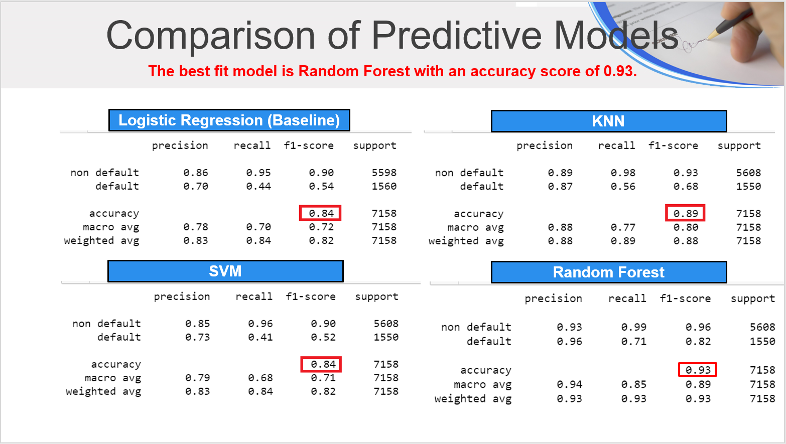

# loan-default-risk

Our team consisted of Ian Housman, TJ Jaramillo, Darlene Ko, and Cy Shi. We created and developed various machine learning predictive models to determine the outcome of a loan at risk of default.  Our team built four predictive models from a data set sourced from Kaggle.com and each of their classification reports are depicted below: 

1) Logistic Regression (Baseline) 
2) KNN (K-Nearest Neighbors)
3) SVM (Support Vector Machine)
4) Random Forest

In comparison, Random Forest had the highest accuracy score of 0.93, which was utilized to subsequently create a simple online website to gather new data from 11 fields from an end-user to ultimately predict the outcome of potential loan default.  Our online submission form is fully deployed through Amazon Web Services (AWS) and can be accessed by clicking the following link:  http://loandefaultrisk-env-2.eba-k2mgprmy.us-east-2.elasticbeanstalk.com/ 

Ultimately, the top four features that ranked from highest to lowest in determining if a loan is at risk of defaulting are as follows:

1) Loan-to-Income Ratio
2) Annual Income
3) Loan Interest Rate
4) Loan Grade

